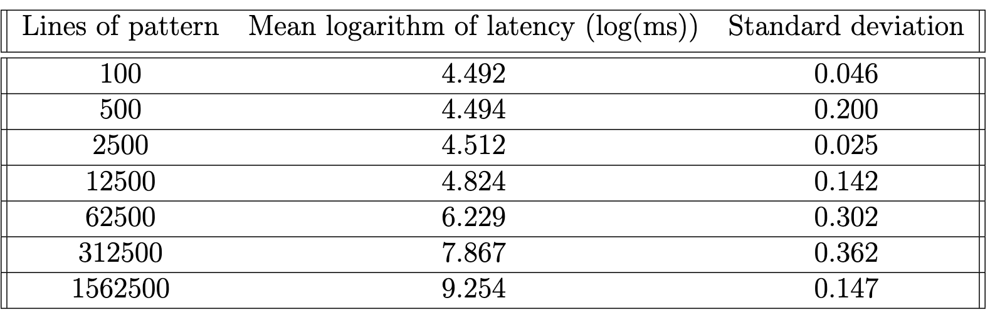

# MP1

## CS425 (Professor Indy)

Authors: Aarya Bhatia \<aaryab@illinois.edu\>, William Zheng \<xinzez2@illinois.edu\>

## Setup Instructions

- Install prerequisites: `g++`, `go`
- Build server and client: `make`
- Run the server: `bin/server <port>`
- Run the client: `bin/client args...`
- Help: `bin/client --help`
- Configure [hosts](./hosts) file to add or remove servers

## Client Options
- The client can either run a grep command or any shell command:
    - To run a grep query on all servers listed in hosts file: `bin/client
      -grep "HTTP"`
    - For grep only specify the query and options. Ex: `bin/client -grep "-i
      http"`
    - To run a command: `bin/client -command "ls -la"` - This will list the
      files on each server relative to the root of the project.
    - To suppress the output: `bin/client ... -silence`
- To change the path to server logs directory: `bin/client -logs data/`. The
  path must contain log files in the format `vm{i}.log`.
- Each server's output will be saved to a file in the output directory
  ("outputs" by default) such as "outputs/vm1.output". You can change the
  output directory by passing the "-output" option.
- Each job will also create a report file containing host metadata. The reports
  path is `reports/<timestamp>`.
- To change the hosts config file you can use the `-hosts` option.

## Scripts

- Deploy latest changes to all hosts and start the server: [deploy.sh](./scripts/deploy.sh)
- All servers have a copy of the Gitlab SSH key, ssh config file and the log file
- The start.sh scripts is copied to each host in cluster over an SSH connection
- The start.sh script is run on each server and clones, builds and starts the servers.
- Script to generate test logs: [log_generation.py](./scripts/log_generation.py)
- Script to run all trials and create the reports: [generate_reports.sh](./scripts/generate_reports.sh)
- Script to create plots from the reports: [create_plots.py](./scripts/create_plots.py)

## Results

[Final Report](./CS425_MP1_Report.pdf)

